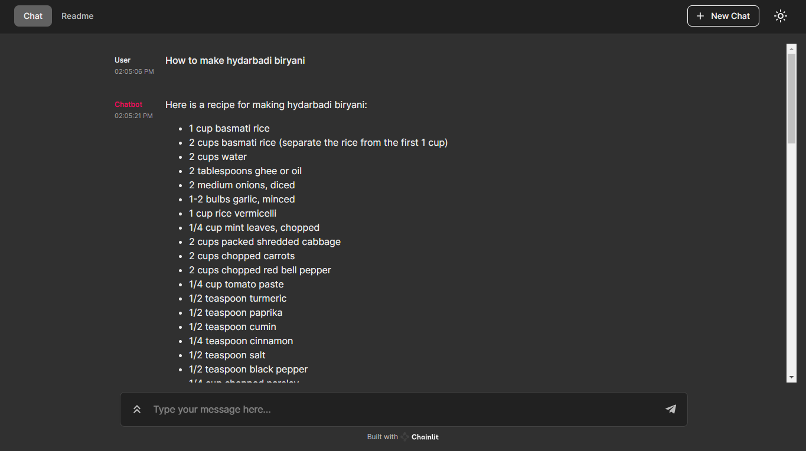

# LLM-langchain-Chatbot
Simple Chat UI using Falcon model, LangChain and Chainlit

LLM "tiiuae/falcon-7b-instruct" are used for this case, but you can try out with the differernt models which are available in the [HuggingFace Leader board](https://huggingface.co/spaces/HuggingFaceH4/open_llm_leaderboard) (Use chatbot based models only)

### Open Source in Action 🚀
- [Falcon](https://falconllm.tii.ae/) as Large Language model
- [LangChain](https://python.langchain.com/en/latest/modules/models/llms/integrations/huggingface_hub.html) as a Framework for LLM
- [Falcon model](https://huggingface.co/tiiuae/falcon-7b-instruct) from Huggingface Website
- [Chainlit](https://docs.chainlit.io/langchain) for deploying.

Overview of Chat bot using LLM 

Chat History are available in left side of the chat whindow (Upright arrow mark)

## Disclaimer
It is not meant to be used in production as it's not production ready. You can modify the code and use for your usecases
